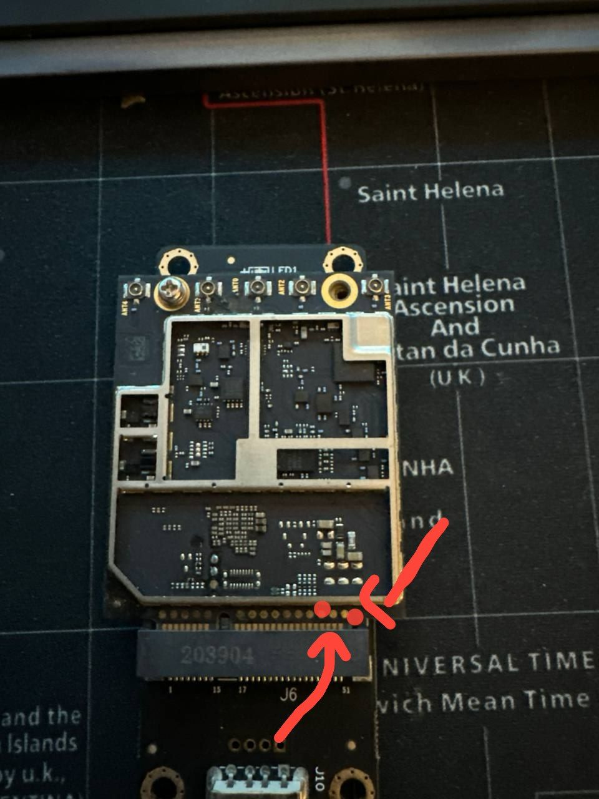

# Enter 'Emergency Download Mode' (EDL) if your unit is bricked

In case of soft bricked unit (usually ZTE device with VID/PID *19d2:0076*) or fully bricked (no sign of life), there is another way to enter the module into ***EDL Mode***.

Here is an image of internal module, the **EDL BOOT POINTS** are the two one with the red arrows


Special thanks to user checkin665 from eko.pl forum


##
Use a paperclip or tweezer to short these two points, keep them shorted and attach the module to the USB.
You should see into *Device Manager* (Windows) or `lsusb` (Linux) a device in ***EDL Mode***:
- For Windows users, you will have this COM port:


- For Linux users you will have this output:
```
  Bus 004 Device 032: ID 05c6:9008 Qualcomm, Inc. Gobi Wireless Modem (QDL mode)
```
  
Remove the paperclip/tweezer and use **QFIL** or **edl** to flash firmware back into the module.
