# Recovery module from an hard brick (Windows only)


## ⚠️ READ CAREFULLY! ⚠️
##  The files you are downloading are not under my control. You accept the risk of using them. If your device or module were to break or even catch fire, I do not hold any responsibility in any way. Therefore, proceed at your own risk!

⚠️ Download and install [these](https://mega.nz/file/ao5TXRiC#Wmbf1dqILKKxXf_uPVHFzIksWK_HdSwvLmI3hGIBTb0) drivers, [QPST](https://qpsttool.com/qpst-tool-v2-7-496) and [TeraTerm](https://github.com/TeraTermProject/teraterm/releases/tag/v5.1) before connect the module to your pc. 
Be sure to have your module in ***EDL Mode*** before go ahead. 
If cannot be enter it using `adb`, follow instruction to use the [EDL short points](https://github.com/stich86/ZTE-MF289F-Recovery/blob/main/enter_edl_brick.md) ⚠️


Download `base QFIL package` from [here](https://mega.nz/folder/q5xl0RCJ#DX-kzPZ3SzQBxm-Q5D1e9w) and software version (with also dummy QCN file and `config` file) you want to run this [MEGA folder](https://mega.nz/folder/KlhwlR5C#K0q2i7tdBYPFvdSESDUrPQ) 

After you have chosen which software version to run, move the following files into same folder of `base QFIL package`:

```
NON-HLOS.ubi
sdxpoorwills-boot.img  
sdxpoorwills-sysfs.ubi 
uefi.elf
```

Now click on `flash.cmd` file and enter the `9008` COM port (just the number). Let's wait until module is flashed, when complete the module will be rebooted.

If everything was fine, your module should appear in the **Device Manager** in `3 TTY` mode (Modem Port, Diagnostic Port, NMEA Port) like this screen:

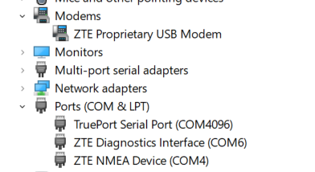

## Restore module configuration (EFS and NV items)

Now it's time to restore EFS partition using the `dummy_IMEI_vfde.qcn` file. This QCN contains **zeroed IMEI**, please refer to [EFS Professional](https://xdaforums.com/t/tool-updated-29-12-14-efs-professional-v2-1-80b-also-for-non-samsung-devices.1308546/) on how to load and modify it, I will not give you instructions on how to do, sorry :-)

When your QCN is filled with your own IMEI, launch `Software Download` program, click on `Restore` tab, load your QCN (select `QCN NV Memory Files` and not XML one) and restore it. When process termiante, the module will be rebooted.

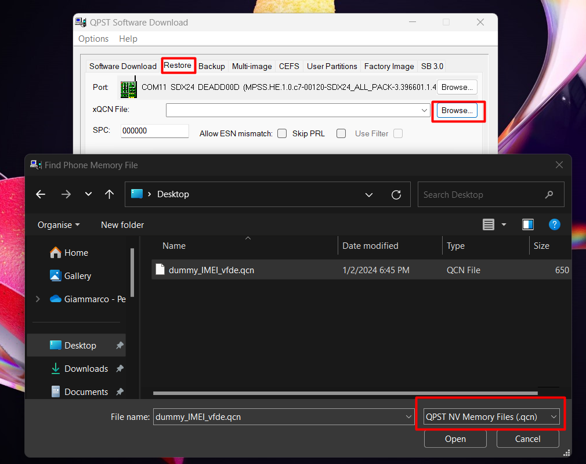

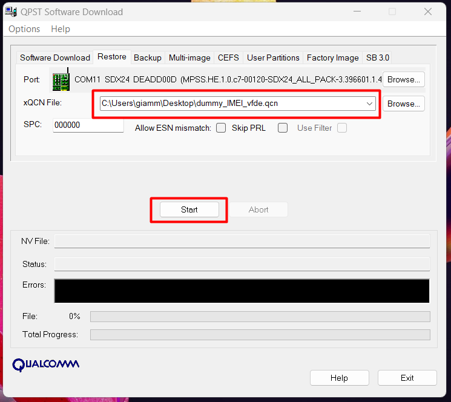

After module is back online, run `EFS Explorer` and copy `config` file into EFS root:

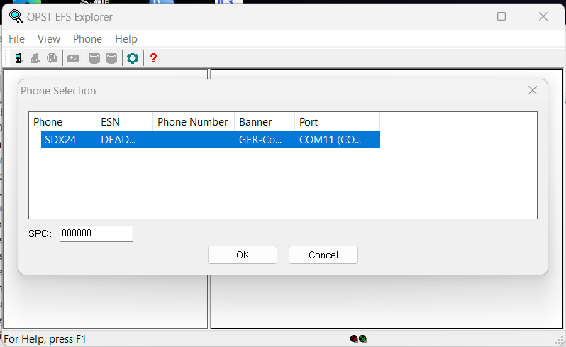

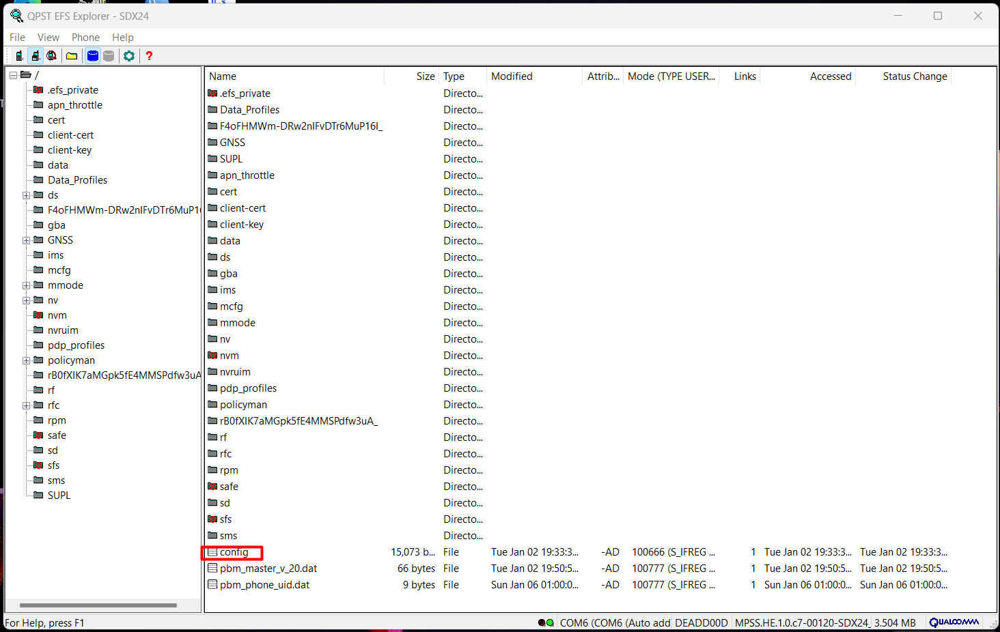

Open TeraTerm and connect to `NMEA` port, then run these commands to put modem back to `4 TTY + QMI` mode:

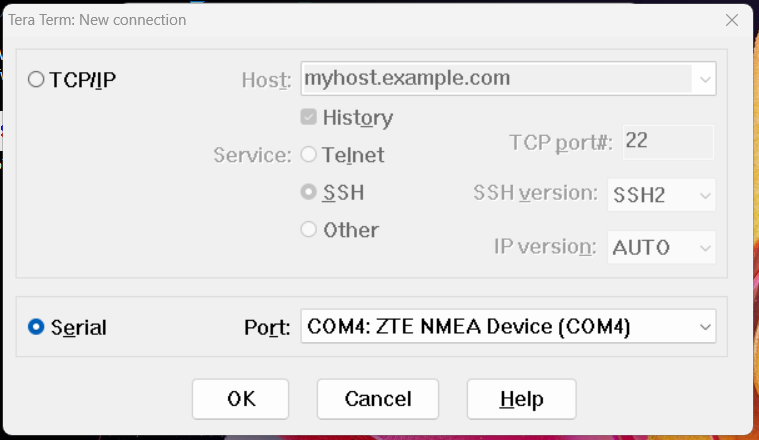

```
AT+ZCDRUN=8
AT+ZCDRUN=F
AT+ZSNT=6,0,0
AT+CFUN=1,1
```

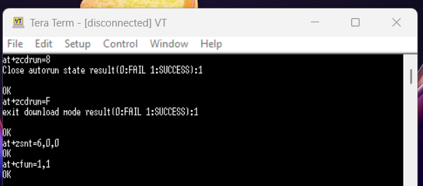

Last reboot and in less than two minutes module should be back in `4 TTY + QMI` mode. From now you can access it again with `adb`

In case you don't get device automatically recognized, just select these one and install relative drivers using option **"Let me pick from a list of available device drivers on my computer"**, select **"All Devices"** and the **"Ports (COM & LPT)"** (Keep attention on instance path!):

## ⚠️ This composition is for VF-DE Firmware ⚠️

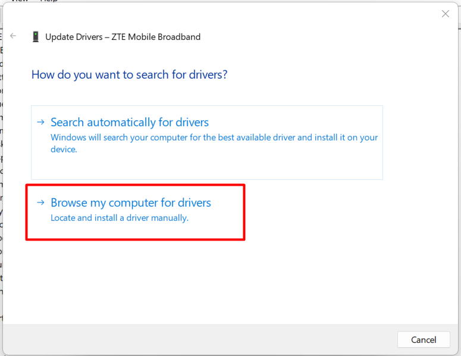
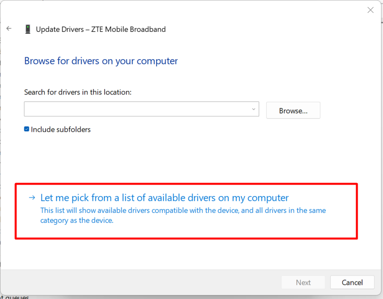
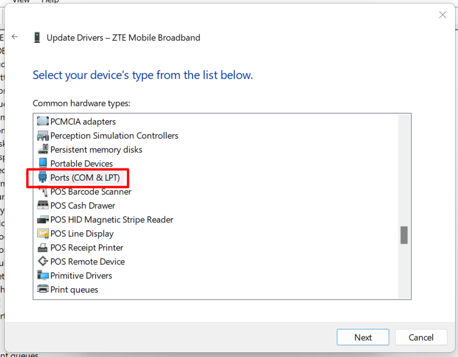
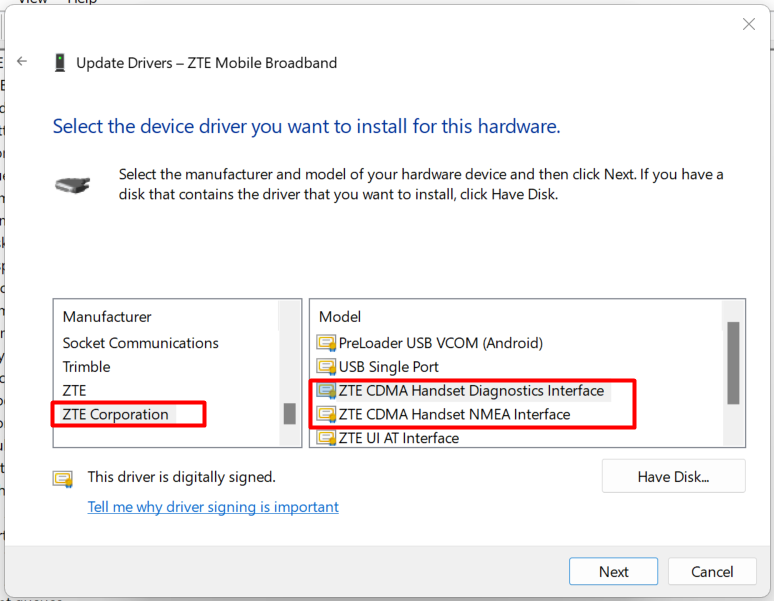

**DIAG PORT** (instance 0000)

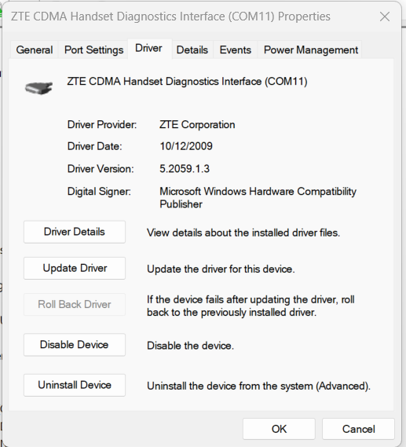
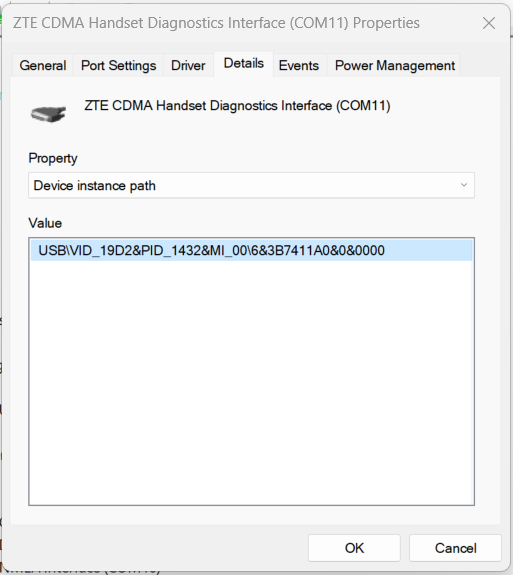

**NMEA PORT** (instance 0001)

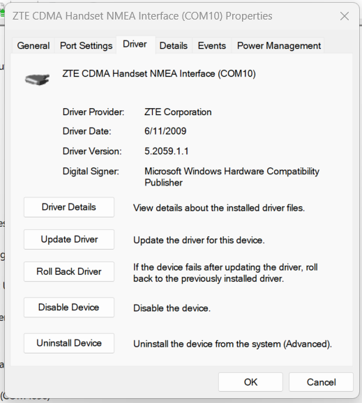
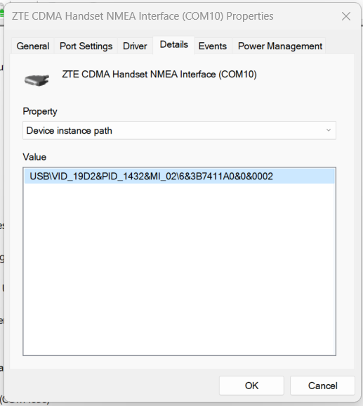

Check if `config` and IMEI were written correctly launching again TeraTerm, connect to `NMEA` port and issue `ATI` command:

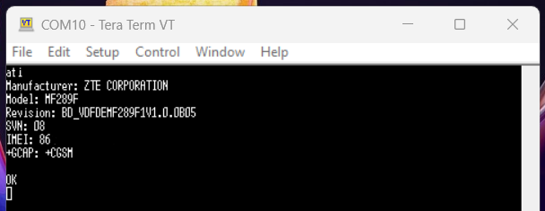

That's it!
